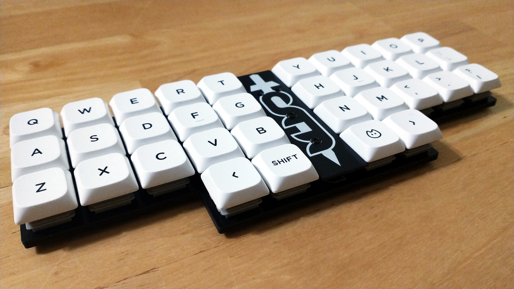
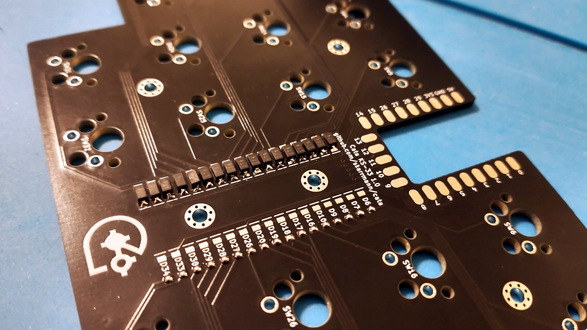

# Cata Keyboard

Cata is a 34 key ortholinear keyboard, powered by a [Waveshare RP2040-Zero](https://www.waveshare.com/rp2040-zero.htm).

It uses [Gateron KS-33 Low Profile 3.0 keyswitches](https://nuphy.com/products/gateron-low-profile-3-0-switches) with 19mm x 19mm spacing.

The PCB design is akin to the [Sha Keyboard](https://github.com/skarrmann/sha), but with fewer keys and different keyswitches.

## Project structure

* [`gerbers`](gerbers): Gerber files for PCB manufacturing
* [`graphics`](graphics): Source assets for PCB silkscreen
* [`kicad`](kicad): KiCad project files (schematics and PCB designs)
* [`kicad-libraries`](kicad-libraries): KiCad components and footprints
* [`images`](images): Images for project documentation

## PCBs

**Each build uses two copies of the main PCB and one copy of the top plate PCB.**

The main PCB is used as the logical PCB. A second copy of the main PCB is used a bottom plate, by flipping it the long way and screwing it directly to the logical PCB.

The plate PCB cover the dev board and diodes. It has cutouts which fit the boot and reset buttons on the dev board.

## Keyboard firmware

* QMK: Coming soon, see [pull request in the QMK firmware repository](https://github.com/qmk/qmk_firmware/pull/25557)
* KMK
    * Setup instructions and basic configuration is in this repo: [`firmware/kmk`](firmware/kmk)

## Bill of materials

Part | Purpose | Quantity | Notes
---- | ------- | -------- | ---------
Main PCB  | logical PCB, bottom plate | 2 | Send Gerber zip files to [JLCPCB](https://jlcpcb.com/)
Top plate PCB  | cover dev board and diodes  | 1 | 
Waveshare RP2040-Zero | Microcontroller board | 1 |
1N4148 SOD-123 | Diodes for keyboard row-column matrix | 34 |
Gateron KS-33 Low Profile 3.0 Keyswitches |  | 34 | [Several options available from Nuphy](https://nuphy.com/products/gateron-low-profile-3-0-switches)
MX Low Profile Keycaps | | 34 | Use low profile keycaps which fit 19mm x 19mm spacing
M2 5mm screws | Screws PCBs together | 12 |
M2 6mm spacers | Spacers between logical PCB and top plates | 2 |
M2 nuts | Holds the top screws between the bottom plate and logical PCB | 8 |

## PCB manufacturing settings

These are the manufacturing settings I used when ordering from JLCPCB:

* **Base Material**: FR4
* **Layers**: 2
* **Dimensions**: (whatever the gerber file specifies)
* **PCB Qty**: 5
* **Different Design**: 1
* **Delivery Format**: Single PCB
* **PCB Thickness**: 1.6
* **PCB Color**: Black
* **Silkscreen**: White
* **Surface Finish**: LeadFree HASL-RoHS
* **Outer Copper Weight**: 1 oz
* **Gold Fingers**: No
* **Confirm Production File**: No
* **Flying Probe Test**: Fully Test
* **Castellated Holes**: No
* **Mark on PCB**: Remove Mark

## Build tips

* Before starting, check if the PCBs are warped, and bend them to be perfectly flat before soldering.
* Make sure the diodes are oriented correctly, cathode on the side with the line! The diodes are very close together, so narrow tweasers can help position them.
    * 
* Make sure the RP2040-Zero is soldered **buttons on top**. The pinout labels printed on the PCB should align with those printed on the dev board.
    * 
    * 

## KiCad project notes

The top plate was generated with the [Horizon Board Producer KiCad plugin](https://github.com/skarrmann/horizon#kicad-project-notes).

## Revision history

* Cata 1.0 (2025-07-27)
    * Initial Gateron KS-33 Low Profile 3.0 switch PCB design
